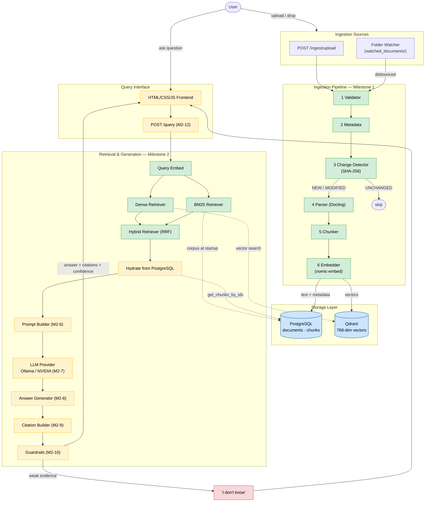
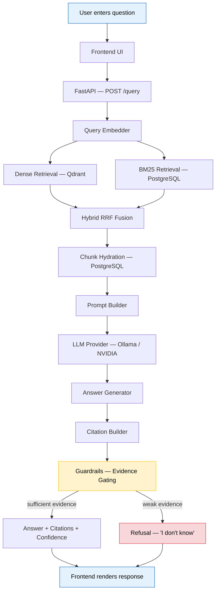
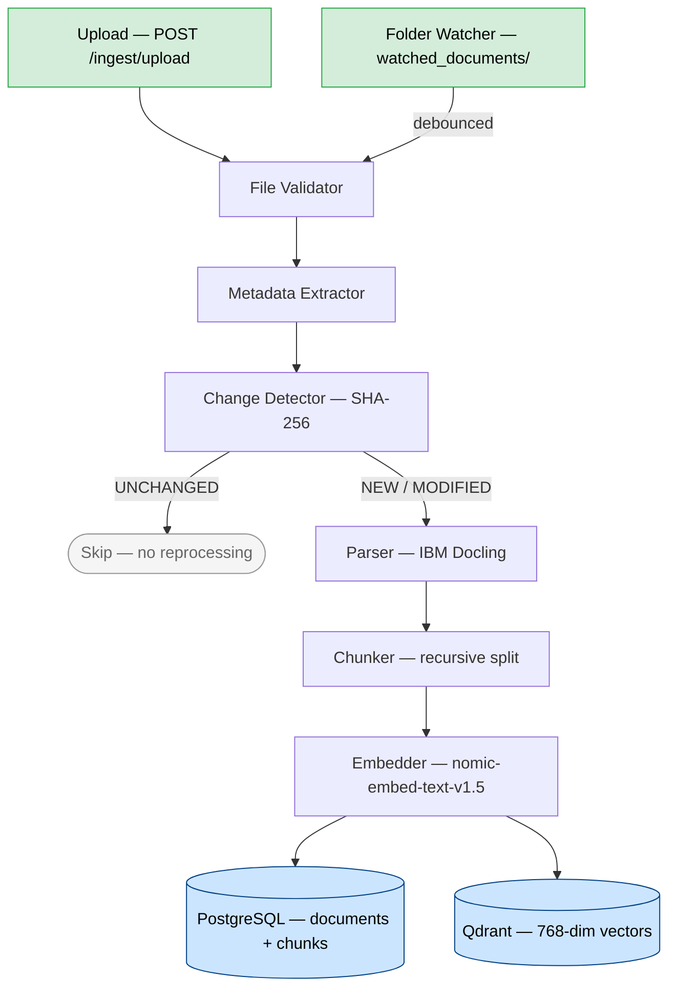
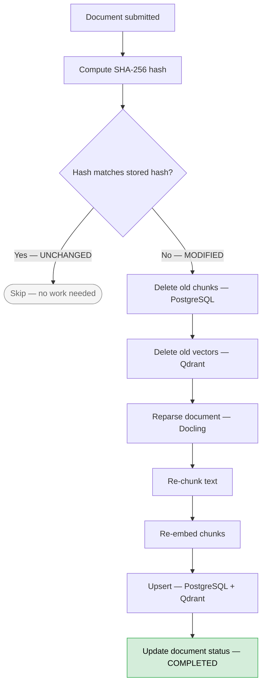
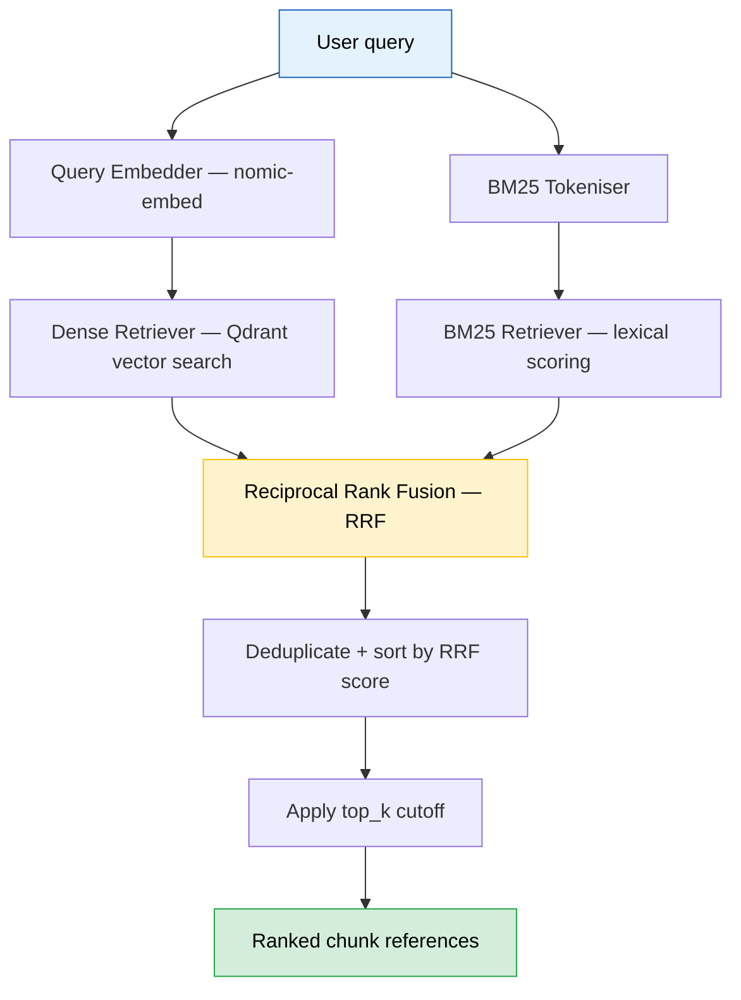
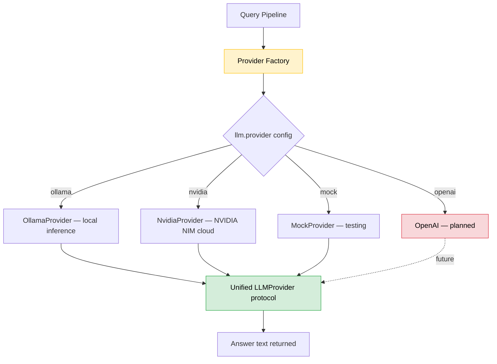
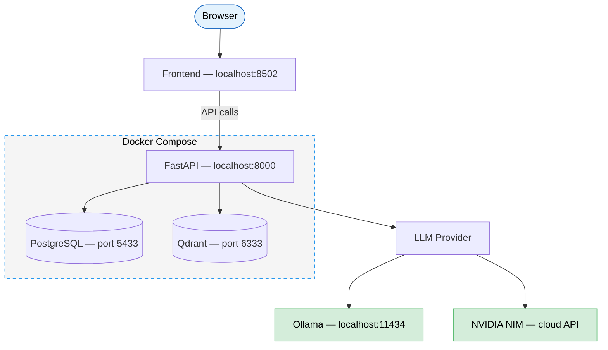

<p align="center">
  
</p>

<h1 align="center">AtlasIQ</h1>

<p align="center">
  <strong>Continuous Knowledge Platform for Intelligent Document Discovery, Retrieval &amp; Evidence-Backed Search</strong>
</p>

<p align="center">
  <a href="#-installation">Quick Start</a> · <a href="#-features">Features</a> · <a href="#-system-architecture">Architecture</a> · <a href="#-api-reference">API</a> · <a href="#-project-roadmap">Roadmap</a> · <a href="#-contributing">Contributing</a>
</p>

<p align="center">
  
  
  
  
  
  
</p>

---

## 📖 Project Overview

AtlasIQ is an enterprise-inspired knowledge platform designed to solve a pervasive problem: **organizational knowledge is constantly growing, changing, and becoming difficult to search.** Instead of acting as another document chatbot, AtlasIQ continuously builds and maintains a searchable knowledge layer from documents, allowing users to ask natural language questions and receive answers backed by relevant evidence.

### Problem Statement

Most document search systems require users to manually upload files and rely solely on basic vector search. They offer no incremental indexing, no evidence citation, and no mechanism to keep knowledge current as documents evolve.

### Why AtlasIQ?

AtlasIQ addresses the **entire knowledge lifecycle**:

- **Continuous ingestion** — monitors folders and accepts uploads, not just one-time imports.
- **Incremental indexing** — only re-processes documents that have changed (SHA-256 change detection).
- **Hybrid retrieval** — combines semantic vector search with BM25 keyword matching via Reciprocal Rank Fusion.
- **Evidence-backed answers** — every response includes source citations, confidence scores, and guardrail-enforced refusals when evidence is insufficient.
- **Analytics & evaluation** — built-in frameworks for retrieval quality monitoring and query analytics.

The goal is a platform that can evolve into an enterprise knowledge system rather than a single-purpose chatbot.

### Key Features at a Glance

| Capability | Description |
| --- | --- |
| Multi-format ingestion | PDF, DOCX, Markdown, TXT with layout-aware parsing |
| Hybrid retrieval | Dense (semantic) + BM25 (lexical) fused via RRF |
| Evidence citations | Source document, page, quote, and relevance score |
| Confidence scoring | Normalised 0.0–1.0 score with guardrail gating |
| LLM flexibility | Swap between Ollama (local) and NVIDIA (cloud) with config only |
| Incremental re-index | SHA-256-based change detection; no duplicate or orphaned chunks |
| Production Docker | Multi-stage Dockerfile + Docker Compose for one-command deploy |

---

## ✨ Features

### Document Ingestion
- Multi-format document support (PDF, DOCX, Markdown, TXT)
- Layout-aware parsing via IBM Docling (preserves tables, headings, structure)
- Automatic metadata extraction (file type, size, word count)
- Recursive character text chunking with configurable overlap
- Continuous folder monitoring via Watchdog
- Incremental indexing with SHA-256 change detection
- Streaming upload with size validation (configurable max, default 50 MB)

### Retrieval
- Dense retrieval — semantic search over Qdrant (768-dim Nomic embeddings)
- BM25 sparse retrieval — in-memory lexical index built at startup
- Hybrid retrieval — Reciprocal Rank Fusion (RRF) merging both result sets
- Cross-encoder reranking via BGE Reranker v2 M3
- Chunk hydration — full text + metadata fetched from PostgreSQL
- Configurable top-k and minimum score thresholds

### Generation
- Grounded QA prompt construction with citation-ready context
- Multi-provider LLM abstraction (Ollama local, NVIDIA cloud)
- Structured answer generation with source attribution
- Temperature, max token, and timeout controls

### Explainability
- Per-citation source document, page, quoted passage, and relevance score
- Normalised confidence scoring (0.0–1.0)
- Guardrail-enforced refusals with transparent reason codes
- Refusal message: *"I don't have enough information to answer this question based on the available documents."*

### Analytics
- Query analytics framework (planned)
- Retrieval evaluation framework (planned)
- Document comparison capabilities (planned)

### Observability
- Structured JSON logging
- Health check endpoint with per-service status (FastAPI, PostgreSQL, Qdrant, LLM)
- Startup validation (schema creation, collection presence, connectivity)

### Deployment
- Multi-stage Docker build for minimal production images
- Docker Compose orchestration (app + PostgreSQL + Qdrant)
- Render cloud deployment support
- Health check with automatic restart policies

---

## 🛠 Technology Stack

| Layer | Technology | Purpose |
| --- | --- | --- |
| **Backend** | FastAPI + Uvicorn | Async API framework with OpenAPI docs and dependency injection |
| **Frontend** | HTML / CSS / JavaScript | Liquid Glass design system; zero-framework, served via Python HTTP server |
| **Database** | PostgreSQL 16 (Alpine) | Document metadata, chunk text, query logs, analytics storage |
| **Vector DB** | Qdrant (latest) | High-performance 768-dim vector search with payload filtering |
| **Retrieval** | Hybrid (Dense + BM25 + RRF) | Combines semantic matching with keyword search for maximum recall |
| **Reranker** | BGE Reranker v2 M3 | Cross-attention re-scoring for precise rank ordering |
| **Embeddings** | Nomic Embed Text v1.5 | 768-dimensional open-source model optimised for retrieval |
| **Parsing** | IBM Docling | Layout-aware document parser preserving tables, headings, structure |
| **LLM Providers** | Ollama / NVIDIA NIM | Local (Gemma, Llama) and cloud (Llama 3.3 70B, DeepSeek) models |
| **BM25** | rank-bm25 | Term-frequency lexical scoring for keyword retrieval |
| **ORM / DB Driver** | asyncpg + SQLAlchemy | Async PostgreSQL connection pooling |
| **Validation** | Pydantic v2 | Request/response validation, settings management |
| **File Watching** | Watchdog | Debounced filesystem event monitoring for continuous ingestion |
| **HTTP Client** | httpx + openai SDK | Async HTTP for LLM provider communication |
| **Containerization** | Docker + Docker Compose | Multi-container orchestration (app, PostgreSQL, Qdrant) |
| **CI/CD** | GitHub Actions (planned) | Ruff formatting, Mypy type-checking, Pytest test suite |
| **Deployment** | Render | Docker-based cloud container hosting |

---

## 🏗 System Architecture

> **Legend:** 🟢 Implemented · 🟡 In Progress · 🔴 Planned · 🔵 Storage



---

## 🔄 Workflow Diagrams

### A) End-to-End Query Flow



### B) Document Ingestion Workflow



### C) Incremental Re-Index Workflow



### D) Hybrid Retrieval Workflow



### E) LLM Provider Selection



### F) Deployment Architecture



---

## 📂 Folder Structure

```text
AtlasIQ/
├── atlasiq/                          # Main application package
│   ├── __init__.py
│   ├── analytics/                    # Analytics & monitoring (planned)
│   │   └── __init__.py
│   ├── backend/                      # FastAPI application layer
│   │   ├── __init__.py
│   │   ├── main.py                   # App factory, lifespan, router mounts
│   │   ├── api/                      # API route handlers
│   │   │   ├── routes_health.py      # GET /health, GET /config/check, POST /config
│   │   │   ├── routes_ingestion.py   # POST /ingest/upload, GET /ingest/status, etc.
│   │   │   └── routes_query.py       # POST /query
│   │   ├── core/                     # Cross-cutting concerns
│   │   │   ├── config.py             # Pydantic Settings (YAML + env vars)
│   │   │   ├── dependencies.py       # FastAPI DI providers
│   │   │   ├── exceptions.py         # Domain exception hierarchy
│   │   │   ├── logging.py            # Structured JSON logging setup
│   │   │   └── startup.py            # DB init, collection setup, validation
│   │   ├── domain/                   # Domain records (DocumentRecord, ChunkRecord)
│   │   │   ├── chunk.py
│   │   │   └── document.py
│   │   ├── models/                   # Pydantic response models
│   │   ├── repositories/             # Data access layer
│   │   │   ├── document_repository.py  # PostgreSQL CRUD for documents + chunks
│   │   │   └── vector_repository.py    # Qdrant write operations
│   │   └── services/                 # Business logic services (planned)
│   ├── database/                     # Database clients & schema
│   │   ├── postgres_client.py        # Async PostgreSQL connection pool
│   │   ├── qdrant_client.py          # Qdrant vector client wrapper
│   │   └── schema.sql                # DDL for documents + chunks tables
│   ├── evaluation/                   # Evaluation framework (planned)
│   │   └── __init__.py
│   ├── frontend/                     # Frontend application
│   │   ├── serve.py                  # Python HTTP server for static files
│   │   └── static/
│   │       ├── index.html            # Single-page app (Liquid Glass design)
│   │       └── logo.png              # AtlasIQ logo
│   ├── ingestion/                    # Document ingestion pipeline
│   │   ├── change_detector.py        # SHA-256 change detection
│   │   ├── chunker.py                # Recursive character text splitting
│   │   ├── embedder.py               # Lazy-loaded sentence-transformers
│   │   ├── metadata.py               # File metadata extraction
│   │   ├── parser.py                 # IBM Docling document parser
│   │   ├── pipeline.py               # Ingestion orchestrator
│   │   ├── validator.py              # File type/size validation
│   │   └── watcher.py                # Watchdog folder monitor
│   └── retrieval/                    # Retrieval & generation pipeline
│       ├── bm25_retriever.py         # BM25 sparse retriever
│       ├── citations.py              # Citation builder
│       ├── dense_retriever.py        # Qdrant dense retriever
│       ├── generator.py              # Answer generator
│       ├── guardrails.py             # Evidence gating & confidence scoring
│       ├── hybrid_retriever.py       # RRF hybrid fusion
│       ├── models.py                 # ScoredChunkRef, RetrievedChunk
│       ├── prompt_builder.py         # Grounded QA prompt construction
│       ├── protocols.py              # Retriever protocol (structural typing)
│       ├── qa_pipeline.py            # End-to-end query orchestrator
│       └── llm/                      # LLM provider abstraction
│           ├── base.py               # LLMProvider protocol
│           ├── factory.py            # Provider factory (config → implementation)
│           ├── mock_provider.py      # Mock for testing
│           ├── nvidia_provider.py    # NVIDIA NIM cloud provider
│           └── ollama_provider.py    # Ollama local provider
├── configs/
│   └── default.yaml                  # Default application configuration
├── prompts/                          # Prompt templates
│   ├── qa_prompt.txt                 # Question-answering prompt
│   ├── citation_prompt.txt           # Citation extraction prompt
│   └── system_prompt.txt             # System instruction prompt
├── tests/                            # Unit and integration tests (45+ files)
├── scripts/                          # Developer tools
│   ├── run_watcher.py                # Standalone folder watcher
│   └── smoke_retrieval.py            # Dense/BM25/Hybrid side-by-side test
├── docs/                             # Architecture decisions, design docs, guides
├── Stitch_design/                    # UI design iterations and screenshots
├── docker-compose.yml                # PostgreSQL + Qdrant + App orchestration
├── Dockerfile                        # Multi-stage production build
├── pyproject.toml                    # Project metadata, dependencies, tool config
├── start_atlasiq.py                  # Unified startup script
└── README.md
```

---

## 🚀 Installation

### Prerequisites

| Requirement | Version | Notes |
| --- | --- | --- |
| Python | 3.12+ | Required (see `pyproject.toml`) |
| Docker + Docker Compose | Latest | For PostgreSQL + Qdrant |
| Git | Latest | To clone the repository |
| Ollama *(optional)* | Latest | Only for local LLM inference |
| NVIDIA GPU *(optional)* | CUDA-capable | Accelerates embedding + reranking |

### 1. Clone the Repository

```bash
git clone https://github.com/verdhanyash/AtlasIQ.git
cd AtlasIQ
```

### 2. Create a Virtual Environment

```bash
python -m venv .venv

# Windows
.venv\Scripts\activate

# macOS / Linux
source .venv/bin/activate
```

### 3. Install Dependencies

```bash
# Core dependencies
pip install -e .

# Development dependencies (pytest, ruff, mypy)
pip install -e ".[dev]"
```

### 4. Configure Environment Variables

```bash
# Copy the example environment file
cp .env.example .env

# Edit .env with your configuration
# At minimum, verify database and Qdrant settings
```

### 5. Start Infrastructure Services

```bash
# Start PostgreSQL and Qdrant via Docker Compose
docker compose up -d postgres qdrant

# Verify services are healthy
docker compose ps
```

---

## ▶️ Running the Project

### Backend (FastAPI)

```bash
# Option A: Use the startup script
python start_atlasiq.py

# Option B: Use the batch file
START_BACKEND.bat

# Option C: Run manually
python -m uvicorn atlasiq.backend.main:app --host 0.0.0.0 --port 8000 --reload
```

### Frontend

```bash
# Option A: Use the batch file
START_FRONTEND.bat

# Option B: Run manually
cd atlasiq/frontend/static
python -m http.server 8502
```

### Docker Compose (Full Stack)

```bash
# Start all services (app + PostgreSQL + Qdrant)
docker compose up -d

# View logs
docker compose logs -f app

# Stop all services
docker compose down

# Stop and remove volumes
docker compose down -v
```

### Verify Installation

```bash
# Health check
curl http://localhost:8000/health
```

**Expected response:**
```json
{
  "status": "healthy",
  "checks": {
    "fastapi": true,
    "postgresql": true,
    "qdrant": true,
    "llm_provider": "ollama",
    "llm_model": "gemma3:4b",
    "config_valid": true
  },
  "timestamp": "2026-06-28T01:00:00.000000+00:00"
}
```

| Endpoint | URL |
| --- | --- |
| Frontend | http://localhost:8502 |
| Backend API | http://localhost:8000 |
| Interactive API Docs (Swagger) | http://localhost:8000/docs |
| ReDoc | http://localhost:8000/redoc |

---

## ⚙️ Environment Variables

All environment variables use the prefix `ATLASIQ_` and double underscore `__` as a section separator. They override values in `configs/default.yaml`.

| Variable | Default | Description |
| --- | --- | --- |
| **Server** | | |
| `ATLASIQ_SERVER__HOST` | `0.0.0.0` | Bind address for the FastAPI server |
| `ATLASIQ_SERVER__PORT` | `8000` | Port for the FastAPI server |
| **PostgreSQL** | | |
| `ATLASIQ_DATABASE__HOST` | `localhost` | PostgreSQL hostname |
| `ATLASIQ_DATABASE__PORT` | `5433` | PostgreSQL port (mapped from container 5432) |
| `ATLASIQ_DATABASE__NAME` | `atlasiq` | Database name |
| `ATLASIQ_DATABASE__USER` | `atlasiq` | Database user |
| `ATLASIQ_DATABASE__PASSWORD` | `atlasiq` | Database password |
| **Qdrant** | | |
| `ATLASIQ_QDRANT__HOST` | `localhost` | Qdrant hostname |
| `ATLASIQ_QDRANT__PORT` | `6333` | Qdrant HTTP port |
| **LLM** | | |
| `ATLASIQ_LLM__PROVIDER` | `ollama` | Active LLM provider (`ollama`, `nvidia`, `mock`) |
| `ATLASIQ_LLM__MODEL` | `gemma3:4b` | Model name for the active provider |
| `ATLASIQ_LLM__TEMPERATURE` | `0.3` | Sampling temperature |
| `ATLASIQ_LLM__MAX_TOKENS` | `1024` | Maximum tokens in LLM response |
| `ATLASIQ_LLM__TIMEOUT_SECONDS` | `60` | Request timeout for LLM calls |
| **Ollama** | | |
| `ATLASIQ_OLLAMA__BASE_URL` | `http://localhost:11434` | Ollama server URL |
| **NVIDIA** | | |
| `ATLASIQ_NVIDIA__BASE_URL` | `https://integrate.api.nvidia.com/v1` | NVIDIA NIM API base URL |
| `ATLASIQ_NVIDIA__API_KEY` | *(empty)* | NVIDIA Build API key ([get one here](https://build.nvidia.com/)) |
| **OpenAI** | | |
| `ATLASIQ_OPENAI__API_KEY` | *(empty)* | OpenAI API key (future provider) |
| **Ingestion** | | |
| `ATLASIQ_INGESTION__STORAGE_DIR` | `./document_storage` | Directory for saved uploads |
| `ATLASIQ_INGESTION__WATCHED_FOLDER` | `./watched_documents` | Monitored folder for auto-ingestion |
| `ATLASIQ_INGESTION__MAX_FILE_SIZE_MB` | `50` | Maximum upload file size |
| **Embedding** | | |
| `ATLASIQ_EMBEDDING__MODEL_NAME` | `nomic-ai/nomic-embed-text-v1.5` | Embedding model name |
| `ATLASIQ_EMBEDDING__DEVICE` | `cuda` | Compute device (`cuda`, `cpu`) |
| **Retrieval** | | |
| `ATLASIQ_RETRIEVAL__DENSE_TOP_K` | `20` | Dense retriever candidate count |
| `ATLASIQ_RETRIEVAL__BM25_TOP_K` | `20` | BM25 retriever candidate count |
| `ATLASIQ_RETRIEVAL__HYBRID_TOP_K` | `20` | Final hybrid result count |
| `ATLASIQ_RETRIEVAL__RERANK_TOP_K` | `5` | Number of results after reranking |
| `ATLASIQ_RETRIEVAL__RRF_K` | `60` | RRF constant `k` (controls rank smoothing) |
| **Cache** | | |
| `ATLASIQ_CACHE__ENABLED` | `true` | Enable/disable query result cache |
| `ATLASIQ_CACHE__MAX_SIZE` | `100` | Maximum cached entries |
| `ATLASIQ_CACHE__TTL_SECONDS` | `3600` | Cache time-to-live in seconds |

---

## 📡 API Reference

### `GET /health`

Health check for all services.

```bash
curl http://localhost:8000/health
```

<details>
<summary>Response (200)</summary>

```json
{
  "status": "healthy",
  "checks": {
    "fastapi": true,
    "postgresql": true,
    "qdrant": true,
    "llm_provider": "ollama",
    "llm_model": "gemma3:4b",
    "config_valid": true
  },
  "timestamp": "2026-06-28T01:00:00.000000+00:00"
}
```
</details>

---

### `POST /ingest/upload`

Upload and ingest a document.

```bash
curl -X POST http://localhost:8000/ingest/upload \
  -F "file=@report.pdf"
```

<details>
<summary>Response (200)</summary>

```json
{
  "document_id": "a1b2c3d4-...",
  "status": "completed",
  "chunks_created": 42,
  "skipped": false,
  "metadata": {
    "filename": "report.pdf",
    "file_type": ".pdf",
    "file_size_bytes": 832338
  }
}
```
</details>

---

### `GET /ingest/status/{document_id}`

Get ingestion status for a specific document.

```bash
curl http://localhost:8000/ingest/status/a1b2c3d4-...
```

<details>
<summary>Response (200)</summary>

```json
{
  "document_id": "a1b2c3d4-...",
  "filename": "report.pdf",
  "status": "completed",
  "file_type": ".pdf",
  "file_size_bytes": 832338,
  "word_count": 12500,
  "chunk_count": 42,
  "created_at": "2026-06-28T01:00:00+00:00",
  "updated_at": "2026-06-28T01:05:00+00:00"
}
```
</details>

---

### `GET /ingest/documents`

List all ingested documents with pagination.

```bash
curl "http://localhost:8000/ingest/documents?limit=10&offset=0"
```

<details>
<summary>Response (200)</summary>

```json
{
  "documents": [
    {
      "document_id": "a1b2c3d4-...",
      "filename": "report.pdf",
      "status": "completed",
      "file_type": ".pdf",
      "created_at": "2026-06-28T01:00:00+00:00"
    }
  ],
  "limit": 10,
  "offset": 0,
  "count": 1
}
```
</details>

---

### `DELETE /ingest/documents/{document_id}`

Delete a document and all associated data (chunks, vectors).

```bash
curl -X DELETE http://localhost:8000/ingest/documents/a1b2c3d4-...
```

<details>
<summary>Response (200)</summary>

```json
{
  "message": "Document deleted successfully",
  "document_id": "a1b2c3d4-..."
}
```
</details>

---

### `POST /query`

Submit a natural-language question.

```bash
curl -X POST http://localhost:8000/query \
  -H "Content-Type: application/json" \
  -d '{"question": "What are the key findings in the financial report?"}'
```

<details>
<summary>Response (200)</summary>

```json
{
  "answer": "The key findings indicate that revenue increased by 15%...",
  "citations": [
    {
      "document_name": "report.pdf",
      "page": "12",
      "quote": "Revenue grew by 15% year-over-year...",
      "chunk_index": 7,
      "score": 0.85
    }
  ],
  "confidence": 0.82,
  "sources": ["report.pdf"],
  "refusal_reason": null
}
```
</details>

---

### `GET /config/check`

Check which provider configurations are available.

```bash
curl http://localhost:8000/config/check
```

<details>
<summary>Response (200)</summary>

```json
{
  "nvidia_api_key_configured": true,
  "openai_api_key_configured": false,
  "current_provider": "ollama",
  "current_model": "gemma3:4b"
}
```
</details>

---

### `POST /config`

Dynamically update the active LLM provider and model.

```bash
curl -X POST http://localhost:8000/config \
  -H "Content-Type: application/json" \
  -d '{"provider": "nvidia", "model": "meta/llama-3.3-70b-instruct", "api_key": "nvapi-..."}'
```

<details>
<summary>Response (200)</summary>

```json
{
  "status": "success",
  "current_provider": "nvidia",
  "current_model": "meta/llama-3.3-70b-instruct"
}
```
</details>

---

## 🔍 Retrieval Pipeline

The retrieval pipeline transforms a natural-language question into an evidence-backed answer through the following stages:

### 1. Query Embedding
The user's question is embedded using the same **Nomic Embed Text v1.5** model used during ingestion, prefixed with `search_query:` to activate the model's asymmetric retrieval mode.

### 2. Dense Retrieval
The query embedding is searched against Qdrant's 768-dimensional vector index. Returns the top-k most semantically similar chunk references ranked by cosine similarity.

### 3. BM25 Retrieval
The query is tokenised and scored against an in-memory BM25 index (built from all chunk text at startup). Returns the top-k most keyword-relevant chunk references.

### 4. Hybrid Retrieval (RRF)
Results from both retrievers are fused using **Reciprocal Rank Fusion**:

```
rrf_score = Σ 1 / (rrf_k + rank)
```

RRF merges by rank position, not raw score — so incomparable scales (cosine similarity vs BM25 term frequency) combine fairly. Chunks are deduplicated and sorted by `(-rrf_score, document_id, chunk_index)` for deterministic ordering.

### 5. Hydration
Chunk references (IDs only) are hydrated with full text, metadata, and document context from PostgreSQL via `get_chunks_by_ids`.

### 6. Prompt Builder
Hydrated chunks are formatted into a grounded QA prompt using the templates in `prompts/`. The system prompt instructs the LLM to answer only from provided evidence and cite sources.

### 7. LLM Generation
The constructed prompt is sent to the active LLM provider (Ollama or NVIDIA). The provider abstraction handles API communication and error translation.

### 8. Citation Builder
The LLM's raw answer is parsed to extract structured citations: document name, page number, quoted passage, chunk index, and relevance score.

### 9. Guardrails
Evidence gating evaluates whether the retrieval evidence is sufficient:
- If the top retrieval score exceeds the confidence threshold → the answer is returned with citations.
- If evidence is weak → the system responds with a refusal message and a confidence score of 0.0.

### 10. Confidence Scoring
A normalised confidence score (0.0–1.0) is derived from retrieval quality and passed to the frontend alongside the answer.

---

## 🤖 LLM Providers

AtlasIQ uses a **provider abstraction** based on Python's `Protocol` (structural typing). All providers implement the same `LLMProvider` protocol with `generate()` and `close()` methods.

### Supported Providers

| Provider | Type | Example Models | Status |
| --- | --- | --- | --- |
| **Ollama** | Local | `gemma3:4b`, `llama3.2:3b`, `mistral:7b` | ✅ Implemented |
| **NVIDIA NIM** | Cloud | `meta/llama-3.3-70b-instruct`, `deepseek-ai/deepseek-v4-pro` | ✅ Implemented |
| **Mock** | Testing | N/A (returns canned responses) | ✅ Implemented |
| **OpenAI** | Cloud | `gpt-4o`, `gpt-4o-mini` | 🔴 Planned |

### Switching Providers

Switching providers requires **configuration only** — no code changes:

```bash
# Switch to Ollama (local)
ATLASIQ_LLM__PROVIDER=ollama
ATLASIQ_LLM__MODEL=gemma3:4b

# Switch to NVIDIA (cloud)
ATLASIQ_LLM__PROVIDER=nvidia
ATLASIQ_LLM__MODEL=meta/llama-3.3-70b-instruct
ATLASIQ_NVIDIA__API_KEY=nvapi-your-key-here
```

Or dynamically via the API:

```bash
curl -X POST http://localhost:8000/config \
  -H "Content-Type: application/json" \
  -d '{"provider": "nvidia", "model": "meta/llama-3.3-70b-instruct"}'
```

### Adding a New Provider

1. Create a new module in `atlasiq/retrieval/llm/` implementing the `LLMProvider` protocol.
2. Register it in `factory.py`'s `create_llm_provider()` function.
3. Add provider-specific config fields to `atlasiq/backend/core/config.py`.

---

## 🧪 Testing

AtlasIQ maintains a comprehensive test suite with **45+ test files** covering every pipeline stage.

### Running Tests

```bash
# Run all tests
pytest

# Run with coverage report
pytest --cov=atlasiq --cov-report=term-missing

# Run a specific test file
pytest tests/test_hybrid_retriever.py -v

# Run tests matching a keyword
pytest -k "test_rrf" -v
```

### Linting & Formatting

```bash
# Check formatting
ruff check .

# Auto-fix formatting issues
ruff check --fix .

# Format code
ruff format .
```

### Type Checking

```bash
# Strict mode type checking
mypy --strict atlasiq/
```

### Smoke Tests

```bash
# End-to-end retrieval smoke test (requires running services)
python scripts/smoke_retrieval.py
```

### Test Categories

| Category | Files | Description |
| --- | --- | --- |
| Ingestion | `test_validator.py`, `test_parser.py`, `test_chunker.py`, `test_embedder.py`, `test_pipeline.py` | Document processing pipeline |
| Retrieval | `test_dense_retriever.py`, `test_bm25_retriever.py`, `test_hybrid_retriever.py` | Search and ranking |
| Generation | `test_llm_provider.py`, `test_prompt_builder.py`, `test_generator.py`, `test_citations.py`, `test_guardrails.py` | LLM and answer generation |
| API | `test_ingestion_api.py`, `test_query_api.py`, `test_query_validation.py` | Endpoint validation |
| Integration | `test_integration_ingestion.py`, `test_qa_pipeline.py` | End-to-end orchestration |
| Frontend | `test_ui.py`, `test_frontend_changes.py` | UI behaviour verification |

---

## 🔄 CI/CD

AtlasIQ uses a quality pipeline (compatible with GitHub Actions) that enforces:

| Stage | Tool | Command |
| --- | --- | --- |
| **Formatting** | Ruff | `ruff check .` |
| **Linting** | Ruff | `ruff check .` (pycodestyle, pyflakes, isort, pep8-naming, bugbear, simplify) |
| **Type Checking** | Mypy (strict) | `mypy --strict atlasiq/` |
| **Unit Tests** | Pytest | `pytest --cov=atlasiq` |

All checks must pass before merge. The pipeline configuration targets Python 3.12+ with strict type safety.

---

## 🐳 Deployment

### Docker Compose (Recommended)

```bash
# Start all services
docker compose up -d

# Verify all containers are healthy
docker compose ps
```

**Expected output:**
```text
NAME                IMAGE                  STATUS              PORTS
atlasiq-app         atlasiq-app            Up (healthy)        0.0.0.0:8000->8000/tcp
atlasiq-postgres    postgres:16-alpine     Up (healthy)        0.0.0.0:5433->5432/tcp
atlasiq-qdrant      qdrant/qdrant:latest   Up (healthy)        0.0.0.0:6333->6333/tcp
```

### Render Deployment

AtlasIQ supports Docker-based deployment on [Render](https://render.com/):

1. Connect your GitHub repository to Render.
2. Create a new **Web Service** with Docker runtime.
3. Set the required environment variables (see [Environment Variables](#️-environment-variables)).
4. Deploy managed PostgreSQL and connect via `DATABASE_URL`.
5. Deploy Qdrant as a private service or use Qdrant Cloud.

### Production Notes

- The Dockerfile uses a **multi-stage build** — the runtime image contains only `libpq5`, no compilers.
- Persistent volumes for PostgreSQL (`postgres_data`) and Qdrant (`qdrant_data`) are defined in `docker-compose.yml`.
- The app container waits for both databases to pass health checks before starting (`depends_on: condition: service_healthy`).
- The health check endpoint (`GET /health`) reports per-service status: `"healthy"` or `"degraded"`.

---

## 📋 Project Roadmap

### Version 1 — Internship Release

| Feature | Status |
| --- | --- |
| Multi-format document ingestion (PDF, DOCX, MD, TXT) | ✅ Complete |
| Layout-aware document parsing (IBM Docling) | ✅ Complete |
| Recursive character text chunking | ✅ Complete |
| Nomic Embed embedding (768-dim) | ✅ Complete |
| PostgreSQL + Qdrant dual storage | ✅ Complete |
| Continuous folder monitoring (Watchdog) | ✅ Complete |
| Incremental indexing (SHA-256 change detection) | ✅ Complete |
| Dense retrieval (Qdrant vector search) | ✅ Complete |
| BM25 sparse retrieval | ✅ Complete |
| Hybrid retrieval (Reciprocal Rank Fusion) | ✅ Complete |
| Prompt builder (grounded QA) | ✅ Complete |
| LLM provider abstraction (Ollama + NVIDIA) | ✅ Complete |
| Answer generation with citation extraction | ✅ Complete |
| Guardrails (evidence gating + confidence scoring) | ✅ Complete |
| Query API (`POST /query`) | ✅ Complete |
| HTML/CSS/JS frontend (Liquid Glass design) | ✅ Complete |
| Docker + Docker Compose deployment | ✅ Complete |
| Health check and startup validation | ✅ Complete |
| Structured JSON logging | ✅ Complete |
| Natural language search interface | ✅ Complete |
| Source citations with page + quote | ✅ Complete |
| Confidence scoring (0.0–1.0) | ✅ Complete |
| Document comparison | ⏳ Planned |
| Analytics dashboard | ⏳ Planned |
| Evaluation dashboard | ⏳ Planned |

### Future Roadmap

| Feature | Category |
| --- | --- |
| Google Drive connector | Ingestion |
| GitHub repository indexing | Ingestion |
| Website ingestion (web scraping) | Ingestion |
| Authentication & authorization | Security |
| Knowledge graph construction | Retrieval |
| Enterprise connectors (Confluence, Notion) | Integration |
| Cloud-native deployment (K8s) | Deployment |
| Advanced retrieval optimisation (ColBERT, SPLADE) | Retrieval |
| OpenAI provider integration | LLM |
| Anthropic provider integration | LLM |
| Streaming responses | Generation |
| Multi-language support | Generation |

---

## ⚡ Performance Characteristics

> Approximate benchmarks measured on a development machine with NVIDIA RTX 3050 GPU.

| Operation | Latency | Notes |
| --- | --- | --- |
| **Document parsing** (Docling) | 2–10s per document | Varies by format, page count, and OCR needs |
| **Chunking** (512 tokens, 50 overlap) | < 50ms per document | In-memory recursive split |
| **Embedding** (nomic-embed, batch 32) | ~200ms per batch | GPU-accelerated; ~6ms per chunk |
| **Dense retrieval** (Qdrant) | < 50ms | Sub-linear via HNSW index |
| **BM25 retrieval** | < 20ms | In-memory index |
| **Hybrid RRF fusion** | < 5ms | Rank-based, no score normalisation needed |
| **LLM generation** (Ollama local) | 2–8s | Depends on model size and prompt length |
| **LLM generation** (NVIDIA cloud) | 1–5s | Network latency + inference |
| **End-to-end query** | 3–15s | Embed → retrieve → generate → cite |

| Resource | Specification |
| --- | --- |
| **Embedding model memory** | ~1.5 GB VRAM (nomic-embed-text-v1.5) |
| **Reranker model memory** | ~1.2 GB VRAM (BGE Reranker v2 M3) |
| **Supported file sizes** | Up to 50 MB (configurable) |
| **Vector dimensions** | 768 (Nomic Embed) |
| **Chunk size** | 512 characters, 50-character overlap |

---

## 🔒 Security Considerations

### Current Limitations (V1)

- **Unauthenticated API** — `POST /ingest/upload` and `POST /query` have no authentication layer. Authentication is out of V1 scope.
- **Local development credentials** — default database credentials (`atlasiq/atlasiq`) are intended for local development only.
- **LLM API keys** — stored in `.env` files; ensure `.env` is in `.gitignore` (it is by default).

### Recommendations for Production

- **Add authentication** — API key or OAuth2 middleware before exposing the API publicly.
- **Rotate secrets** — use a secrets manager (Vault, AWS Secrets Manager) instead of `.env` files.
- **Network isolation** — PostgreSQL and Qdrant should not be exposed publicly; use Docker's internal networking.
- **Input validation** — filename sanitisation is already implemented (path traversal prevention). File content scanning is recommended for production.
- **HTTPS** — deploy behind a reverse proxy (Nginx, Caddy) with TLS termination.

---

## 📸 Screenshots

> Screenshots of the AtlasIQ frontend UI.

| View | Description |
| --- | --- |
| **Home Page** | Main search interface with the Liquid Glass design |
| **Document Upload** | Drag-and-drop upload with progress indicator and metadata display |
| **Search Results** | Query response with answer, citations, confidence score, and source documents |
| **Analytics** | Query analytics and retrieval quality metrics *(planned)* |
| **Evaluation** | Retrieval evaluation dashboard *(planned)* |

---

## 🤝 Contributing

### Development Workflow

1. **Fork** the repository and create a feature branch.
2. **Branch naming**: `feature/description`, `fix/description`, or `docs/description`.
3. **Make changes** following the project's coding style and engineering guidelines.
4. **Run the full quality pipeline** before submitting:
   ```bash
   ruff check .
   mypy --strict atlasiq/
   pytest
   ```
5. **Submit a pull request** with a clear description of changes.

### Coding Standards

- **Formatter**: Ruff (line length 100, Python 3.12 target)
- **Type checking**: Mypy strict mode — all functions must have type annotations
- **Architecture**: Dependency injection, separation of concerns, single responsibility
- **Testing**: Every new component should have corresponding unit tests
- **Documentation**: Preserve all existing comments and docstrings

### Engineering Principles

- **Knowledge should stay up to date.**
- **Answers should be backed by evidence.**
- **Search should understand both keywords and meaning.**
- **The system should be modular and easy to extend.**

---

## 📄 License

This project is licensed under the **MIT License**. See the [LICENSE](LICENSE) file for details.

---

## 👤 Author

**Yash Verdhan Parihar**

- **Role**: Machine Learning & Software Engineering Intern
- **Segment**: Foundations of Applied Machine Learning
- **Problem Statement**: I2 — Document Q&A (RAG over a Focused Corpus)
- **GitHub**: [verdhanyash](https://github.com/verdhanyash)
- **LinkedIn**: [Yash Verdhan Parihar](https://linkedin.com/in/)

---

<p align="center">
  <sub>Built with purpose. Engineered for knowledge.</sub>
</p>
